<p align="center">
  
</p>

<p align="center"><em>Memory-layout-first schemas for zero-copy cross-language data structures.</em></p>

<p align="center">
  
</p>

`schema-pop` calculates the exact in-memory layout of your data and uses **that** as the source of truth. From a single TypeScript schema you generate perfectly packed native structs for **Rust, C, C++, Zig, TypeScript, GLSL, WGSL** — plus docs, OpenAPI, randomized fixtures, and more.

```ts
import { scope, binary } from "schema-pop";

export const $ = scope({
    ...binary.import(),

    DeviceStatus: "'Idle' | 'Active' | 'Error' | 'LowBattery'",
    BatteryInfo: {
        voltage: "u32",
        current: "i32",
        legacy_temp: "Obsolete<i16, 'use ThermalSensor in v2'>",
    },
    SensorFrame: {
        ts: "u32",
        ax: "i16", ay: "i16", az: "i16",
    },
});
```

`bun run generate` and out comes `#[repr(C, align(4))] struct BatteryInfo` in Rust, `struct alignas(4) BatteryInfo` in C++, `extern struct` in Zig, an interface in TS, and a self-contained HTML docs page with memory-layout SVGs — all with byte-identical layouts validated by an end-to-end ABI consistency test.

---

## What problem does this solve?

Keeping binary-compatible structures synchronized across languages is painful. Especially when you mix TypeScript / Rust / C++ / GPU buffers / WASM / networking / embedded.

Most existing solutions force compromises: runtime overhead, serialization copies, fragile versioning, generated-code lock-in, awkward GPU interop.

`schema-pop` takes a different angle. The schema **is** the memory layout. Everything else — typed views, codecs, docs, validators — is generated from it.

---

## Quick start

```bash
bun create schema-pop
```

Interactive scaffold; pick a project name, **monorepo / standalone / "give me all"**, and which language harnesses you want (Rust / C++ / Zig / TS — TS is required for the ABI consistency test).

What you get in `--type all`:

- `packages/schema/` — your TypeScript schemas + `pop.config.ts`
- `packages/{rust,cpp,zig,ts,bf}/` — generated artifacts + buildable harnesses
- one `bun run build` orchestrates the whole pipeline: schema generation → cross-language native compilation → ABI round-trip test

```bash
cd my-project && bun install && bun run build
```

The build ends with something like:

```
🛡️  Cross-Language ABI Consistency Test

📁 Version: pin_status_1_0
  ▶️  Rust  ✅ DeviceStatus, ✅ SetPinMode, ✅ SetPinState …
  ▶️  C++   ✅ DeviceStatus, ✅ SetPinMode, ✅ SetPinState …
  ▶️  Zig   ✅ DeviceStatus, ✅ SetPinMode, ✅ SetPinState …
  ▶️  BF    ✅ (layout-only)

✨ All 32 ABI checks passed!
```

That's the schema, generated for 4 languages, compiled to native binaries, fed identical bytes, and verified byte-for-byte equal across all of them.

---

## Features

### Constraint-based primitive inference

Define data with regular `arktype` constraints; the analyzer picks the smallest binary representation that fits.

```ts
age: "0 <= number <= 120",        // → u8
score: "0 <= number <= 65535",    // → u16
flags: "0 <= number < 4",         // → u2 (2 bits, packed)
```

Works on schemas you didn't write — feed in OpenAPI / JSON-schema-derived ArkType definitions and they become packed binary structs.

### Layout strategies

`aligned` (C/Rust ABI), `zero-padding` (network protocols), `std140` / `std430` (GPU buffers). Same schema, different packing rules.

### Tagged unions, enums, bit-fields, opaque aliases

First-class support; the analyzer pre-computes tag offsets, variant sizes, bit positions, struct alignment.

### `Obsolete<T, "reason">`

Mark fields or types as deprecated in the schema. Exporters render language-native deprecation: `#[deprecated]` (Rust), `[[deprecated]]` (C++), JSDoc `@deprecated` (TS), `deprecated: true` (OpenAPI), pill + strikethrough in the HTML docs site.

### Standalone generated code

Generated artifacts have no runtime dependency on `schema-pop`. Vendor them, copy them, modify them, ship them. The TS codec also stands alone.

### Self-contained HTML docs

The `html` exporter emits a single `index.html` with embedded React + inline SVG memory-layout visualizations, multi-version sidebar, ⌘K type search, side-by-side compare overlay, light/dark theme. Open straight from the filesystem.

### Cross-language ABI test harness

The scaffold generates buildable harnesses in each selected language plus a TS driver. The TS side encodes random fixtures via `PopCodec`, spawns each native harness over stdin/stdout, and verifies bytes round-trip identically. Catches layout bugs the moment you save a schema.

### Exporter ecosystem

| Exporter                  | Purpose                                |
| ------------------------- | -------------------------------------- |
| `rust`, `c`, `cpp`, `zig` | Native structs (FFI-safe, ABI-stable)  |
| `ts`                      | Interfaces + optional `PopCodec` glue  |
| `glsl`, `wgsl`            | GPU storage / uniform buffer structs   |
| `html`                    | Multi-version docs site with mem viz   |
| `svg`                     | Standalone memory-layout illustrations |
| `openapi`                 | OpenAPI 3.0 component schemas          |
| `nuxt-ui`                 | Form-generation example                |
| `random`                  | Randomized fixtures for testing        |
| `brainfuck`               | Yes, really.                           |

Writing your own exporter is a single function — see [docs/exporters/writing_own_exporters.md](./docs/exporters/writing_own_exporters.md).

---

## Status

`schema-pop` is **0.1** — pre-release. Core ideas and APIs are stabilizing, but breaking changes may still happen, exporters may evolve, and generated formats may change. Not yet recommended for production-critical systems.

But then again — who am I to stop you ;)

The 0.2 milestone freezes the `ExporterPlugin` interface and adds custom-migration hooks. See [`docs/roadmap.md`](./docs/roadmap.md).

---

## Documentation

Technical:

- [`docs/architecture.md`](./docs/architecture.md) — pipeline overview
- [`docs/analyzer/inference.md`](./docs/analyzer/inference.md) — constraint-based primitive mapping
- [`docs/analyzer/layouts.md`](./docs/analyzer/layouts.md) — layout strategies (aligned / packed / std140 / std430)
- [`docs/binary-protocol.md`](./docs/binary-protocol.md) — wire format for primitives & complex types
- [`docs/exporters.md`](./docs/exporters.md) — exporter overview
- [`docs/naming-strategies.md`](./docs/naming-strategies.md) — `snake_case` / `camelCase` / `PascalCase` / `original`
- [`docs/versioning-and-migrations.md`](./docs/versioning-and-migrations.md) — multi-version schemas

For exporter authors:

- [`docs/exporters/writing_own_exporters.md`](./docs/exporters/writing_own_exporters.md) — write a new language target

---

## Philosophy

The goal is not to replace every serializer. The goal is to make binary-native systems dramatically easier to build by treating memory layout as the canonical representation of data. That gives:

- predictable binary compatibility
- zero-copy interop
- language-independent schemas
- simpler migrations
- GPU interoperability
- portable codecs

Generated code looks **hand-written**. No wrappers, no runtime metadata, no hidden allocations. Just native structs in your language of choice.

---

## AI-friendly by design

`schema-pop` exposes exporters through a deliberately simple programmatic API. If a target you need doesn't exist yet, you can write one quickly with an LLM agent and the [exporter guide](./docs/exporters/writing_own_exporters.md) — minutes instead of days, no plugin boilerplate.

Large parts of this project were built with the help of AI agents. Architecture, type-system gymnastics, layout edge cases, and ABI debugging still required very human suffering.

---

## Use cases

Game engines · multiplayer netcode · WASM systems · GPU compute pipelines · realtime applications · robotics · embedded systems · binary protocols · ECS architectures · simulation tooling.

---

## Contributing

Especially welcome: exporters, edge-case schemas, ABI compatibility validation, language targets, documentation, examples.

For larger PRs, please read [`docs/developers/submission rules.md`](./docs/developers/submission%20rules.md) and [`docs/roadmap.md`](./docs/roadmap.md) first.

---

## Supporters

[kodown1k](https://github.com/kodown1k)

---

## Support

Testing, feedback, ideas, contributions, sponsorship, spare inference tokens — all welcome.

**[karol@3ksoft.org](mailto:karol@3ksoft.org)**

---

## License

MIT
